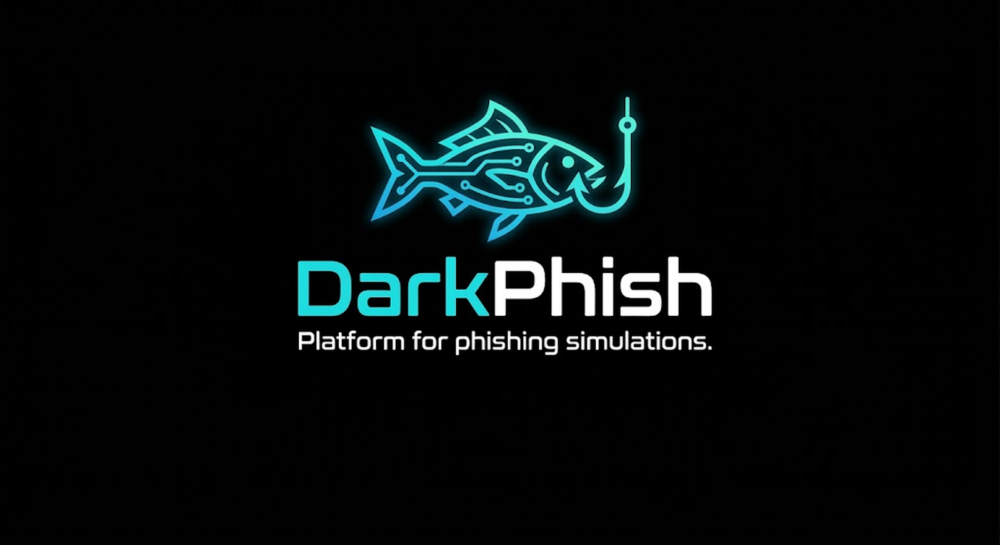

# DarkPhish



[](https://github.com/darkarmy-cyber/darkphish/actions/workflows/ci.yml)
[](https://github.com/darkarmy-cyber/darkphish/actions/workflows/codeql.yml)

DarkPhish is an open-source platform for authorized phishing simulations, human-risk testing, security-awareness programs, and defensive research.

It gives security teams a central place to prepare campaigns, manage users and groups, build email templates and landing pages, monitor results, investigate user risk, and maintain an auditable phishing-simulation program.

DarkPhish is designed as a native, self-hosted platform with a Go backend, web administration interface, REST API, SQLite/MySQL/PostgreSQL support, protected secrets, audit logging, and verified native release updates.

> DarkPhish is intended only for environments where you have explicit authorization to perform phishing simulations or security testing.

## Install

For a fresh installation on a supported Linux server:

```sh
git clone https://github.com/darkarmy-cyber/darkphish.git
cd darkphish
sudo ./install.sh
```

The installer automatically:

- detects the Linux distribution and CPU architecture;
- installs required system dependencies;
- verifies or installs the required Go toolchain;
- builds DarkPhish from the checked-out source;
- creates the dedicated `darkphish` system account;
- prepares the application, configuration, database, permissions, and production security keys;
- creates and enables a hardened `systemd` service;
- starts DarkPhish and prints the administration URL and next steps.

The installer supports fresh `systemd`-based Linux deployments on `amd64` and `arm64`. It deliberately refuses to overwrite an existing DarkPhish installation.

Full installation details: [docs/INSTALLATION.md](docs/INSTALLATION.md)

## First login

The administration interface listens on localhost by default:

```text
https://127.0.0.1:3333
```

For a remote server, use an SSH tunnel:

```sh
ssh -L 3333:127.0.0.1:3333 <user>@<server>
```

Then open:

```text
https://localhost:3333
```

Default administrator username:

```text
admin
```

The installer creates the initial administrator password in an owner-protected bootstrap file. Display it with:

```sh
sudo cat /var/lib/darkphish/bootstrap/darkphish_initial_admin_password
```

Change the bootstrap password immediately after the first login.

## Service management

```sh
sudo systemctl status darkphish
sudo systemctl restart darkphish
sudo journalctl -u darkphish -f
```

Default application directory:

```text
/opt/darkphish
```

Production security material is stored separately under:

```text
/etc/darkphish
```

## Core capabilities

- Phishing campaign creation and scheduling
- Email templates and landing pages
- User and group management
- Sending profiles and campaign delivery
- Campaign results and reporting
- Human-risk and security-awareness workflows
- Reporting mailbox / IMAP processing
- REST API with scoped personal access tokens
- Tamper-evident administrative audit trail
- Protected integration and credential secrets
- SQLite, MySQL/MariaDB, and PostgreSQL support
- Verified native application updates

## Documentation

- [Installation](docs/INSTALLATION.md)
- [Production deployment](docs/DEPLOYMENT.md)
- [Native updates](docs/UPDATES.md)
- [Development](docs/DEVELOPMENT.md)
- [Architecture](docs/ARCHITECTURE.md)
- [Security policy](SECURITY.md)
- [Changelog](CHANGELOG.md)

## License

DarkPhish is distributed under the MIT License.

The project is derived from Gophish. Original copyright and license notices are preserved in [LICENSE](LICENSE), with additional project attribution in [NOTICE.md](NOTICE.md).
